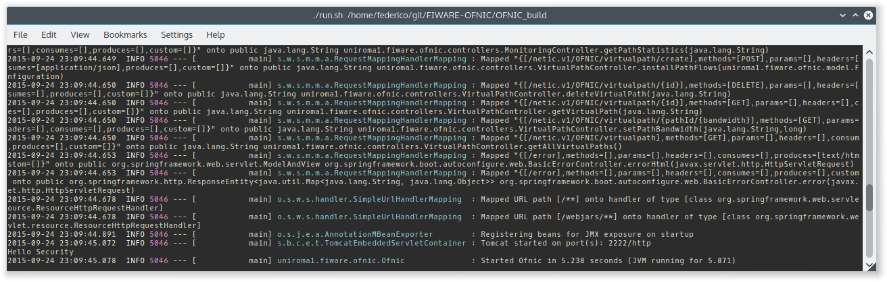

Welcome to FIWARE OFNIC GE's documentation!
==============================================================

.. _page: https://github.com/FIWARE-UNIROMA1/FIWARE-OFNIC/blob/master/README.md
.. _here: http://forge.fiware.org/plugins/mediawiki/wiki/fiware/index.php/FIWARE.OpenSpecification.I2ND.NetIC_R4
.. _NetIC_RESTful_API: http://forge.fiware.org/plugins/mediawiki/wiki/fiware/index.php/FIWARE.OpenSpecification.I2ND.NetIC_R4

Refer to this page_ for more general information about OFNIC.

-------------------------------------------------------------

.. _Installation-and-Administration:

Installation & Administration
==============================================================

Goal of the document
==============================================================

The OFNIC is an implementation of the NetIC Generic Enabler Open Specifications. This GEi is in charge of providing a common programmable interface to an Openflow Network, by collecting information and statistics regarding the managed Openflow network node's. This interface is based on the NetIC Open API RESTful specifications. The OFNIC GEi is an extension of the open-source OpenDaylight Controller. It relies on the Openflow protocol to retrieve network information about the managed network. The OFNIC GEi provides also a Graphical User Interface (GUI) based on web technologies. Basically this is a web page with javascript code that communicates with the RESTful interface of the GEi. 

Goal of this document is to provide a useful guide for the installation of OFNIC GEi, together with its GUI. The document starts describing basic software and hardware required to support the OFNIC GEi on top of a device. It then follows with specific technical information that might help users and administrators: running processes, diagnosis tests, network flows etc.

OFNIC GEi
==============================================================

Software and Hardware environment
-------------------------------------------------------------

The OFNIC OpenFlow controller runs in a Java Virtual Machine. Being a Java application, it can (potentially) runs on any machine that supports Java. However, all the software have been tested on recent Linux distributions, so we recommend the following:

* A recent Linux distribution (for example Ubuntu 14.04 LTS  or Debian 7.x)
* Java Virtual Machine 1.7

Prerequisites
-------------------------------------------------------------

As the previous paragraph, being a Java application, the only requistite is Java Virtual Machine.

On an Ubuntu machine, you can satisfy these requirements with:

    sudo apt-get install openjdk-7-jdk git

Getting OFNIC
-------------------------------------------------------------

There are two options for obtaining the OFNIC Controller. The first option is to download the pre-built current build. The second option is to getting the source code of the component and build the code on your machine.

The pre-built package can be downloaded  here:

    https://github.com/FIWARE-UNIROMA1/FIWARE-OFNIC/releases/download/v2.0/FIWARE-OFNIC-v2.0.zip
    

Another way of getting the source code is to pull the code by cloning the controller repository on GitHub with the following commands:

    git clone https://github.com/FIWARE-UNIROMA1/FIWARE-OFNIC.git

Build the code
-------------------------------------------------------------

Prerequisites
-------------------------------------------------------------

The following are required for building the codebase:

* Maven 3.x.y

If you use a Debian or Ubuntu machine, you can install Maven with the following command:

    *sudo apt-get install maven*

and check the installed version with:

    *mvn -v*

Using a system shell locate in the main OFNIC source code directory, where is located the pom.xml maven’s configuration file. Run the following commands:

    *mvn clean install*

Running
-------------------------------------------------------------
The command reported below starts the OFNIC controller:
    *./start.sh*

Note: If you are building OFNIC from the source, you have to download the pre-build package, then replace the .jar file with the one produced by maven during the build

Sanity check procedures
==============================================================

The Sanity Check Procedures are the steps that a System Administrator will take to verify that an installation is ready to be tested. This is therefore a preliminary set of tests to ensure that obvious or basic malfunctioning is fixed before proceeding to unit tests, integration tests and user validation.

End to End testing
----------------------------------------------------------

This is basically quick testing to check that everything is up and running.

1. Launch ofnic with the command:

    *./start.sh*

2. To verify that the OFNIC GEi is loaded correctly it should display bootstrap complete in the terminal on which it was launched.

3. Network nodes side, on ovs switch give the following command to verify that the device is correctly connected with the controller :

    *ovs-vsctl show*

it should display the following log message:

* Bridge "br0"
* Controller "tcp:127.0.0.1" is_connected: true
* Port "br0"
* Interface "br0" type: internal

4. After this two checks have been done, the GEi should be up and ready. To test that is actually running a simple check can be done from the browser. With an internet browser application, go to the following address:

    http://localhost:2222/api-docs

should display the list of all API of OFNIC GEi. The credentials to access the page are the one in the ofnic.conf file.

List of Running Processes
---------------------------------------------------

In order to list running processes on a Linux distribution one can use ps aux command. In order to get more filtered results one can use this more articulated command:

    *ps aux | grep "Name_of_process"*

In the machine that hosts the OFNIC GEi the run.sh process is required to be active.
So by typing in the terminal:

    *ps aux | grep run.sh*

.. image:: diagn_b.png

Network interfaces Up & Open
------------------------------------------------------------

The OFNIC GEi listens to the ports 6633, 2222 and 8080, with the following command you can verify it:

    *netstat -lnptu | grep tcp*

in the terminal you will see a list of the process listen on port 6633, 8080 and 2222.

Diagnosis Procedures
==============================================================

OFNIC logs to the stdout on the terminal on which it was launched.

Resource availability
--------------------------------------------------------

The required RAM depends on many factors such as network topology, number of flows in the network, frequency of the statistics updates, frequency of web service requests, etc. 

* Generally RAM size varies from 100 MB to 250 MB.
* Usually the disk size required during run time is negligible.

Remote Service Access
-------------------------------------------

User can verify the correct execution of the OFNIC, by directing the browser (all types are supported) to the following page:

    http://localhost:8000/api-docs

which should display a list of commands that can be sent to the interface. Note that if the browser app is not on the same machine of the GE, the remote IP address of the GEi can be used.

Resource consumption
--------------------------------------------------------

The resource consumption is highly dependent on the number of network events processed. The minimum amount of RAM is nearly 200 MB so eventually in any lower amount of RAM means that the application did not load properly. Under normal working conditions RAM size reaches the order of 250 MB so values of greater orders mean that there is some malfunctioning. CPU percentage ranges and is highly dependent on the processor speed. However it should be noted that at idle state the OFNIC processor consumption can be even lower that 0.1%.

I/O flows
--------------------------------------------------------

Port 2222 for RESTful API and port 6633 for the communication with the network nodes via OpenFlow plugin..

